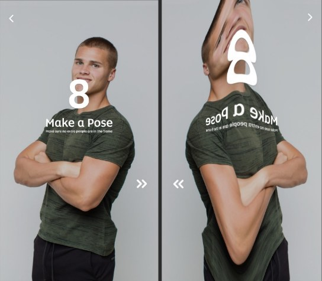
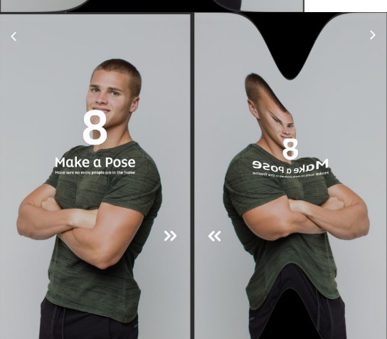
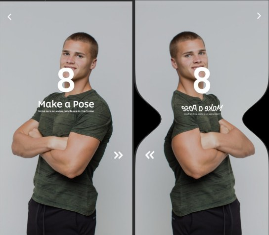
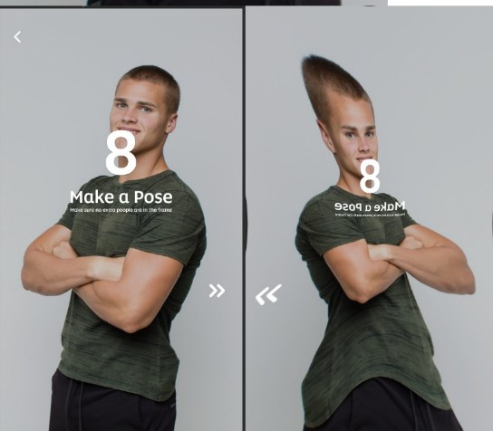
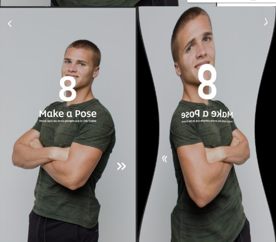
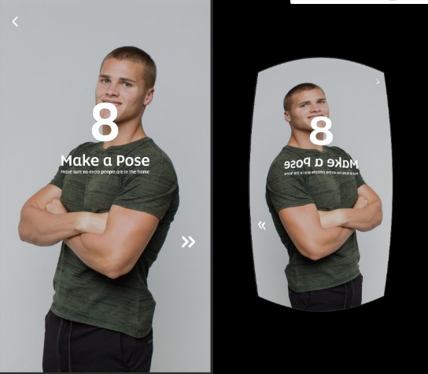

# Funny Mirrors 🪞

Funhouse-mirror effects built with computational geometry. Each mirror bends a flat 3D mesh by modifying its **Z coordinate** with a mathematical function (Gaussian, sine wave, or square root), then a virtual camera projects the bent surface back onto the image, producing a playful, distorted reflection.



## How it works

1. A flat 3D mesh the size of the image is created.
2. Its Z coordinate is shifted by a function of X and Y (the "mirror shape").
3. A virtual camera projects the bent 3D points back to 2D.
4. The original image is remapped onto those points with OpenCV.

## The six mirrors

Formulas below match the code exactly, where $x, y$ are mesh coordinates, $W, H$ are the image width and height, and

$$g(t) = \frac{1}{0.1\sqrt{2\pi}}\, e^{-\frac{1}{2}\left(\frac{t}{0.1}\right)^2}$$

| # | Effect | Z offset | Result |
|---|--------|----------|--------|
| 1 | Gaussian bump along X | $20\, g(x/W)$ |  |
| 2 | Gaussian dip along X | $-10\, g(x/W)$ |  |
| 3 | Gaussian dip along Y | $-10\, g(y/W)$ |  |
| 4 | Sine waves on X and Y | $20\sin\left(2\pi\frac{x - W/4}{W}\right) + 20\sin\left(2\pi\frac{y - H/4}{H}\right)$ |  |
| 5 | Inverted sine waves | $-20\sin\left(2\pi\frac{x - W/4}{W}\right) + 20\sin\left(2\pi\frac{y - H/4}{H}\right)$ |  |
| 6 | Square-root bowl | $-100\sqrt{(x/W)^2 + (y/H)^2}$ |  |

## Getting started

```bash
git clone https://github.com/rwwf980000/funny-mirrors.git
cd funny-mirrors
pip install -r requirements.txt
```

## Usage

```bash
# Apply all six mirrors; results are saved to ./output
python funny_mirrors.py path/to/photo.jpg

# Apply specific mirrors, choose the output folder, and preview each result
python funny_mirrors.py path/to/photo.jpg --mirrors 1 4 6 --output results --show
```

Each saved image shows the original and the mirrored version side by side.

## Project structure

```
funny-mirrors/
├── funny_mirrors.py        # main script
├── requirements.txt
├── docs/
│   ├── FunMirrors_report.docx   # project report
│   └── images/                  # demo results
└── README.md
```

## Acknowledgements

Built on the [`vcam`](https://pypi.org/project/vcam/) virtual-camera library and inspired by Kaustubh Sadekar's original [FunMirrors](https://github.com/kaustubh-sadekar/FunMirrors) project.

## Author

**Rawaf Al-Nafea** · [Portfolio](https://rwwf980000.github.io/) · [LinkedIn](https://www.linkedin.com/in/rawaf-al-nafea)
